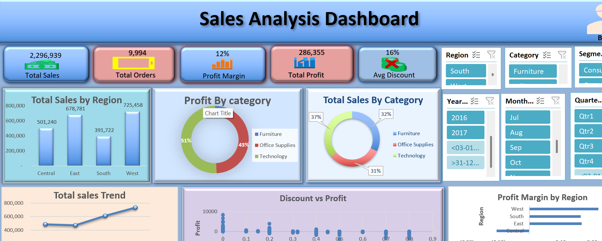

# 📊 Sales Analysis Excel Dashboard

## 📌 Project Description
This project features an **interactive Excel Dashboard** designed to analyze and visualize sales data effectively.  
The dashboard helps in understanding **sales trends, performance metrics, and business insights** using charts, KPIs, and pivot tables.

---

## 📂 Files Included
- **Sales Analysis Dashboard.xlsx** → Main Excel file containing dashboard
- **README.md** → Project documentation
- **screenshots/** → Dashboard preview images
- **data/** → Source dataset

---

## 📊 Dashboard Tab
The Excel file includes a dedicated **Dashboard tab** that contains:
- KPI cards (Total Sales, Profit, Quantity, etc.)
- Interactive charts and graphs
- Pivot table–based visualizations
- Filters / slicers for dynamic analysis

⚠️ **Important Note:**  
GitHub cannot display Excel dashboards interactively.  
➡️ Please **download the Excel file and open it in Microsoft Excel (Desktop version)** to view the Dashboard tab properly.

---

## 🖼️ Dashboard Preview
(Add a screenshot of the Dashboard tab for quick viewing)

```md

```
--sd-

## 🛠️ Tools & Techniques Used
- Microsoft Excel
- Pivot Tables & Pivot Charts
- Excel Formulas
- Data Cleaning & Formatting
- Dashboard Design & Visualization

---

## 📈 Key Insights Provided
- Overall sales performance
- Time-based sales trends
- Category-wise analysis
- Region-wise comparison
- Identification of top-performing segments

---

## 🚀 How to Use This Dashboard
1. Download the Excel file from this repository
2. Open it using **Microsoft Excel (2019 or later recommended)**
3. Navigate to the **Dashboard** tab
4. Use filters/slicers to explore insights

---

## 🎯 Use Cases
- Data Analytics Portfolio Project
- Student Academic Project
- Business Sales Reporting
- Interview Demonstration
- Excel Dashboard Practice

---

## 👤 Author
**Alok Kumar Jha**

---

## ⭐ Support
If you find this project useful, please consider **starring ⭐ the repository**.